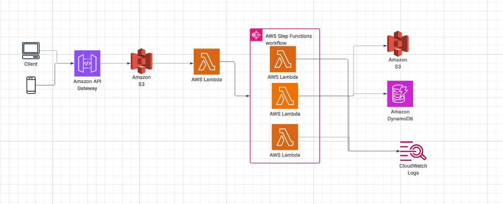

# Serverless Image Processing Workflow on AWS

This project demonstrates a serverless image processing application built using AWS services. Users upload images to an S3 bucket, which triggers a Lambda function to process and resize the images. Processed images are then stored in a separate S3 bucket, optionally accompanied by metadata and orchestrated workflows.

---

##  Architecture Overview

### Components:
- **Client**: A user or application that uploads images.
- **Amazon S3**: 
  - Stores the original images (source bucket).
  - Stores processed images (destination bucket).
- **AWS Lambda**: Triggered by S3 events to process images (resize, watermark).
- **Amazon API Gateway** *(Optional)*: Provides an HTTP endpoint for uploads.
- **Amazon DynamoDB** *(Optional)*: Stores image metadata such as filenames, dimensions, and timestamps.
- **AWS Step Functions** *(Optional)*: Manages more complex workflows and error handling.
- **Amazon CloudWatch Logs**: Captures logs for monitoring and debugging.

---

## Workflow

1. A user uploads an image to the **Source S3 Bucket**.
2. The upload triggers an **AWS Lambda** function.
3. The Lambda function:
   - Retrieves and processes the image (e.g., resizes or adds watermark).
   - Stores the result in the **Destination S3 Bucket**.
4. Metadata is written to **Amazon DynamoDB**.
5. **AWS Step Functions** manage complex multi-step processes.
6. Logs are stored in **Amazon CloudWatch Logs**.

---

##  Technologies Used

- **Amazon API Gateway**
- **Amazon S3**
- **AWS Lambda**
- **AWS Step Functions**
- **Amazon DynamoDB**
- **Amazon CloudWatch**

---

## Benefits

- **Fully Serverless** – No server provisioning or management.
- **Scalable** – Automatically handles growing image upload volume.
- **Cost-Efficient** – Pay only for what you use.
- **Modular** – Easily extendable with additional AWS services.
- **Secure** – Fine-grained access control with IAM.

---

