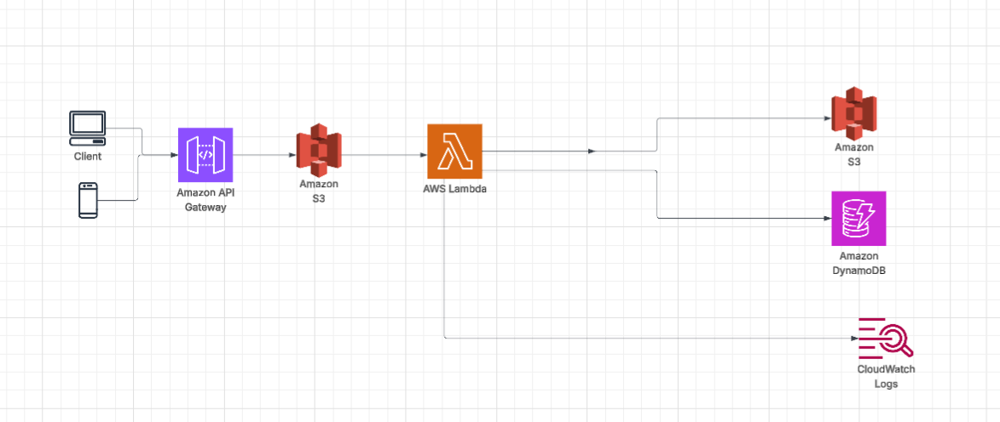

# Serverless Image Processing Workflow on AWS

This project demonstrates a serverless image processing application built using AWS services. Users upload images through an HTTP API, which stores them in an S3 bucket. This triggers a Lambda function that processes the image and stores the output, while also logging activity and optionally saving metadata.

---

## Architecture Overview

### Components:
- **Client**: A user or application (web/mobile) that uploads images.
- **Amazon API Gateway**: Provides an HTTP endpoint for clients to securely upload images to S3.
- **Amazon S3**: 
  - Stores the uploaded images (source bucket).
  - Stores processed images (destination bucket or same bucket with a different key/prefix).
- **AWS Lambda**: Triggered by S3 events to process images (e.g., resize, watermark).
- **Amazon DynamoDB**: Stores image metadata such as filenames, processing status, and timestamps.
- **Amazon CloudWatch Logs**: Captures logs for monitoring, debugging, and auditing.

---

## Workflow

1. A user uploads an image via **Amazon API Gateway**.
2. The API Gateway uploads the image to the **Amazon S3** bucket.
3. The S3 upload triggers an **AWS Lambda** function.
4. The Lambda function:
   - Retrieves and processes the image (e.g., resizes or adds watermark).
   - Stores the processed image in **Amazon S3**.
   - Writes metadata (e.g., filename, timestamp, dimensions) to **Amazon DynamoDB**.
   - Sends logs and execution details to **Amazon CloudWatch Logs**.

---

## Technologies Used

- **Amazon API Gateway**
- **Amazon S3**
- **AWS Lambda**
- **Amazon DynamoDB**
- **Amazon CloudWatch**

---

## Benefits

- **Fully Serverless** – No server provisioning or management.
- **Scalable** – Automatically handles growing image upload volume.
- **Cost-Efficient** – Pay only for what you use.
- **Modular** – Easily extendable with additional AWS services.
- **Secure** – Fine-grained access control with IAM and API Gateway.

---

